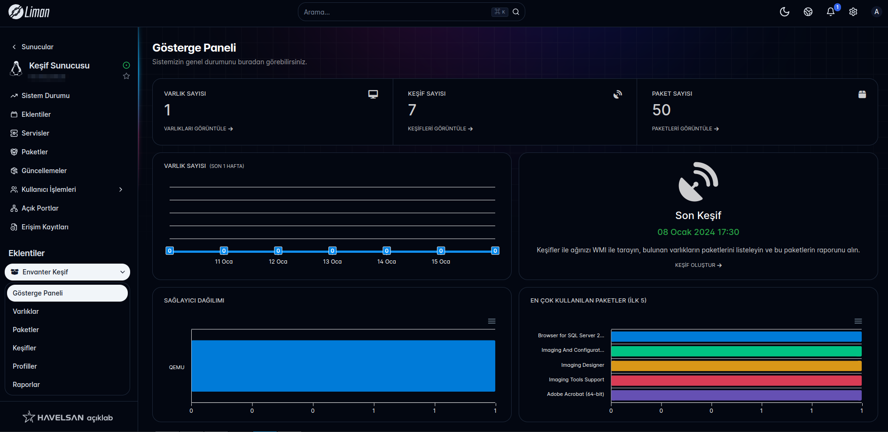

[![Contributors][contributors-shield]][contributors-url]
[![Forks][forks-shield]][forks-url]
[![Stargazers][stars-shield]][stars-url]
[![Issues][issues-shield]][issues-url]
[![MIT License][license-shield]][license-url]

<!-- PROJECT LOGO -->
 

  

  <h3 align="center">Inventory Explorer Extension</h3>

  

    Scan the network with WMI 
     
     
    <a href="https://docs.liman.dev/"><strong>Explore the docs »</strong></a>
     
     
    <a href="https://github.com/limanmys/liman-inventory/issues">Report Bug</a>
    ·
    <a href="https://github.com/limanmys/liman-inventory/issues">Request Feature</a>
  

<!-- ABOUT THE PROJECT -->

## About The Project

This open-source tool allows you to scan your network to discover connected devices and find their packages. It also provides statistical data for your devices on the network.

### Features

- **Network Device Identification**: Quickly identifies devices connected to the network.
- **VMI Technology**: Utilizes VMI for deep inspection capabilities.
- **Open-Source**: Built using open-source libraries, ensuring transparency and flexibility.

<a href="https://github.com/limanmys/inventory-server">Backend Repository »</a>

(<a href="#readme-top">back to top</a>)

<!-- LICENSE -->

## License

Distributed under the MIT License. See `LICENSE` for more information.

(<a href="#readme-top">back to top</a>)

<!-- MARKDOWN LINKS & IMAGES -->
<!-- https://www.markdownguide.org/basic-syntax/#reference-style-links -->

[contributors-shield]: https://img.shields.io/github/contributors/limanmys/liman-inventory.svg?style=for-the-badge
[contributors-url]: https://github.com/limanmys/liman-inventory/graphs/contributors
[forks-shield]: https://img.shields.io/github/forks/limanmys/liman-inventory.svg?style=for-the-badge
[forks-url]: https://github.com/limanmys/liman-inventory/network/members
[stars-shield]: https://img.shields.io/github/stars/limanmys/liman-inventory.svg?style=for-the-badge
[stars-url]: https://github.com/limanmys/liman-inventory/stargazers
[issues-shield]: https://img.shields.io/github/issues/limanmys/liman-inventory.svg?style=for-the-badge
[issues-url]: https://github.com/limanmys/liman-inventory/issues
[license-shield]: https://img.shields.io/github/license/limanmys/liman-inventory.svg?style=for-the-badge
[license-url]: https://github.com/limanmys/liman-inventory/blob/master/LICENSE
